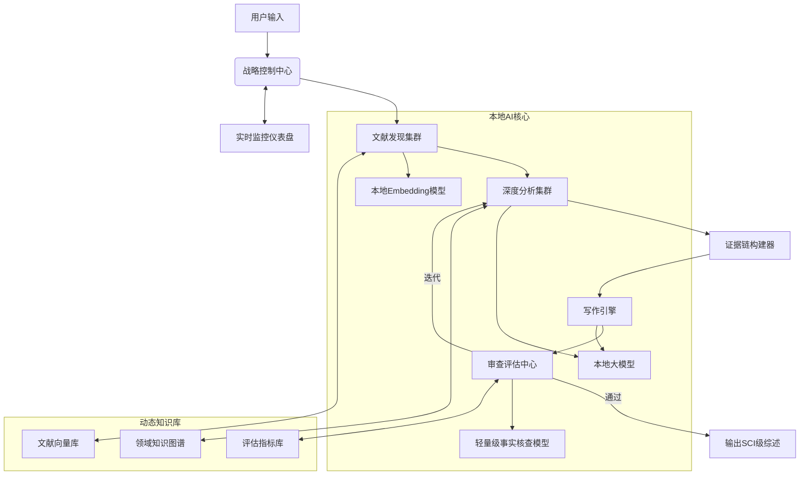

# Surveyassitant

### 增强版个人级文献综述系统设计方案  
**专为个人开发者优化，融合专业级功能与轻量化实现**

---

### 系统架构设计  


---

### 核心智能体设计（适配个人开发环境）

| **智能体**          | **核心功能**                                                                 | **轻量化实现方案**                                                                 |
|---------------------|-----------------------------------------------------------------------------|----------------------------------------------------------------------------------|
| **战略控制中心**    | - 动态任务规划<br>- 资源调度<br>- 紧急预案生成                                | 基于优先级队列的任务调度器<br>故障转移：自动保存检查点<br>资源感知模式切换（CPU/GPU） |
| **文献发现集群**    | - 跨平台检索(arXiv/PubMed)<br>- 新兴方向探测<br>- 专利文献融合                | 异步爬虫+语义过滤<br>增量更新机制<br>本地缓存数据库（SQLite+FAISS）              |
| **深度分析集群**    | - 结构化信息抽取<br>- 贡献-局限识别<br>- 实验数据解析                         | 微调SciBERT模型<br>规则引擎+LLM协同分析<br>PDF文本坐标锚定                      |
| **证据链构建器**    | - 三重交叉验证<br>- 可复现性检查<br>- 冲突结论溯源                            | 轻量级证据图谱<br>本地代码沙箱（Docker容器）<br>声明-证据匹配算法               |
| **写作引擎**        | - 动态模板生成<br>- 学术修辞优化<br>- 自动可视化                             | Markdown/LaTeX模板引擎<br>绘图微服务（Matplotlib+Plotly）<br>风格控制器         |
| **审查评估中心**    | - 事实一致性检查<br>- 抄袭检测<br>- 动态质量评估<br>- 可信度评分              | 局部敏感哈希(LSH)<br>轻量规则引擎<br>迭代反馈机制                               |

---

### 增强型工作流程

```mermaid
sequenceDiagram
    用户->>战略控制中心： 输入研究主题
    战略控制中心->>文献发现集群： 启动检索任务
    文献发现集群->>战略控制中心： 实时进度（已获取35/50篇）
    战略控制中心->>深度分析集群： 分配精读任务
    深度分析集群->>证据链构建器： 提交初步结论
    
    loop 证据强化
        证据链构建器->>代码沙箱： 实验复现请求
        代码沙箱-->>证据链构建器： 复现结果（成功/部分）
        证据链构建器->>深度分析集群： 验证报告
    end
    
    深度分析集群->>写作引擎： 结构化知识输入
    写作引擎->>审查评估中心： 生成草稿
    审查评估中心->>战略控制中心： 评估报告（可信度0.92）
    
    alt 未达标
        战略控制中心->>深度分析集群： 启动迭代任务
    else 达标
        战略控制中心->>用户： 输出最终综述
    end
```

---

### 关键模块实现方案

#### 1. 战略控制中心
```python
class ControlCenter:
    def __init__(self):
        self.task_queue = PriorityQueue()
        self.resource_monitor = ResourceTracker()
        self.checkpoint_manager = CheckpointSystem()
        
    def dynamic_scheduling(self):
        """资源感知的任务调度"""
        if self.resource_monitor.gpu_available():
            return "GPU加速模式"
        elif self.resource_monitor.memory > 16*GB:
            return "批量处理模式"
        else:
            return "精简安全模式"
    
    def emergency_plan(self, error_code):
        """故障转移预案"""
        plans = {
            "TIMEOUT": "重启容器+降低并发",
            "DATA_CONFLICT": "启动交叉验证",
            "LOW_CONFIDENCE": "扩展文献检索"
        }
        return plans.get(error_code, "人工干预警报")

    def generate_roadmap(self, query):
        """动态生成执行路线图"""
        return {
            "phases": [
                {"name": "文献检索", "KPI": "≥50篇", "time": "2h"},
                {"name": "深度分析", "KPI": "5个技术方向", "time": "4h"},
                {"name": "证据强化", "KPI": "≥3重验证", "time": "2h"},
                {"name": "写作审查", "KPI": "可信度≥0.95", "time": "1h"}
            ],
            "quality_gates": {
                "关键论文覆盖率": "≥90%",
                "方法对比完整性": "≥3种方案"
            }
        }
```

#### 2. 审查评估中心
```python
class Validator:
    def __init__(self):
        self.plagiarism_detector = LSHasher()
        self.fact_checker = FactCheckModel()
        self.quality_metrics = {
            "completeness": 0.4,
            "novelty": 0.3,
            "credibility": 0.3
        }
    
    def cross_validation(self, claims):
        """三重交叉验证"""
        results = []
        for claim in claims:
            # 方法1：直接证据匹配
            direct_match = self._match_evidence(claim)
            
            # 方法2：间接推论验证
            indirect_verify = self._inference_check(claim)
            
            # 方法3：实验复现
            repro_result = self._reproduce_experiment(claim)
            
            score = 0.4*direct_match + 0.3*indirect_verify + 0.3*repro_result
            results.append((claim, score))
        return results
    
    def generate_report(self, draft):
        """多维评估报告"""
        return {
            "plagiarism_score": self.plagiarism_detector.scan(draft),
            "fact_consistency": self.fact_checker.evaluate(draft),
            "academic_norm": self.check_format(draft),
            "overall_score": self.calculate_quality(draft)
        }
```

#### 3. 证据链构建器
```python
class EvidenceBuilder:
    def __init__(self):
        self.knowledge_graph = nx.DiGraph()
        self.docker_sandbox = CodeSandbox()
    
    def add_evidence(self, claim, source):
        """添加证据节点"""
        self.knowledge_graph.add_node(claim, type='claim')
        self.knowledge_graph.add_node(source, type='source')
        self.knowledge_graph.add_edge(source, claim, relation='supports')
        
    def visualize_chain(self, claim):
        """生成证据溯源图"""
        subgraph = self.knowledge_graph.subgraph(
            nx.descendants(self.knowledge_graph, claim) | {claim}
        )
        net = Network()
        net.from_nx(subgraph)
        net.save("evidence_chain.html")
    
    def verify_reproducibility(self, paper):
        """实验可复现性验证"""
        if 'github_url' in paper:
            result = self.docker_sandbox.run_experiment(
                paper['github_url'],
                paper['experiment_setup']
            )
            return result.success_rate
        return 0.0  # 无法复现
```

#### 4. 动态知识库
```python
class KnowledgeBase:
    def __init__(self):
        self.vector_db = FAISSIndex()
        self.graph_db = NetworkXGraph()
        self.citation_db = SQLiteDB()
        
    def incremental_update(self, new_papers):
        """增量更新机制"""
        # 查重过滤
        unique_papers = self.filter_duplicates(new_papers)
        
        # 向量化存储
        embeddings = self.embed_texts([p['abstract'] for p in unique_papers])
        self.vector_db.add(embeddings, metadata=unique_papers)
        
        # 知识图谱更新
        for paper in unique_papers:
            self.graph_db.add_paper(paper)
        
        # 引用关系构建
        self.citation_db.update_citations(unique_papers)
    
    def detect_emerging_trends(self):
        """新兴方向探测"""
        recent = self.get_papers(last_n_months=6)
        cluster_labels = self.cluster_embeddings(recent)
        return self.identify_new_clusters(cluster_labels)
```

---

### 本地AI集成方案

#### 模型配置
```yaml
models:
  embedding: 
    name: "bge-large-en-v1.5"
    path: "/models/bge-large"
    quantized: true
    
  llm:
    name: "Qwen2.5-7B-Chat"
    path: "/models/qwen2_5-7b-chat-Q8_0.gguf"
    context: 8192
    
  fact_check:
    name: "FactLLM"
    path: "/models/factllm-3b"
```

#### 资源感知推理
```python
def adaptive_inference(text, model_type):
    """根据资源自动选择推理模式"""
    config = load_config()
    
    if model_type == "embedding":
        model = SentenceTransformer(config.models.embedding.path)
        return model.encode([text])[0]
    
    elif model_type == "llm":
        llm = Llama(
            model_path=config.models.llm.path,
            n_ctx=config.models.llm.context,
            n_threads=get_available_cores(),
            n_gpu_layers=30 if use_gpu() else 0
        )
        return llm(text)
    
    elif model_type == "fact_check":
        if use_gpu():
            return torch_inference(text)
        else:
            return onnx_inference(text)  # 轻量ONNX运行时
```

---

### 完整工作流实现

```python
def enhanced_workflow(query):
    # 初始化系统
    control = ControlCenter()
    kb = KnowledgeBase()
    
    # 阶段1: 动态规划
    roadmap = control.generate_roadmap(query)
    
    # 阶段2: 文献发现
    papers = LiteratureHunter().fetch_papers(query)
    kb.incremental_update(papers)
    
    # 阶段3: 深度分析
    insights = []
    for paper in priority_papers:
        analysis = DeepAnalyzer(paper).run()
        evidence = EvidenceBuilder().build(analysis)
        insights.append(evidence)
    
    # 阶段4: 知识整合
    report = KnowledgeWeaver().generate_report(insights)
    
    # 阶段5: 写作与审查
    draft = WritingEngine().compose(report)
    validation = Validator().evaluate(draft)
    
    # 闭环控制
    if validation['overall_score'] < 0.95:
        control.adjust_plan(validation['weak_areas'])
        return enhanced_workflow(query)  # 迭代执行
    else:
        return format_output(draft, validation)
```

---

### 部署与优化方案

#### 硬件适配方案
| **场景**       | **配置方案**                          | **性能预期**               |
|----------------|--------------------------------------|--------------------------|
| 笔记本CPU模式  | 4核CPU+16GB内存                      | 处理50篇文献/8小时        |
| 入门GPU加速    | RTX 3060+16GB内存                    | 处理100篇文献/4小时       |
| 高性能工作站   | RTX 4090+64GB内存                    | 处理200篇文献/2小时       |


#### 关键性能优化
1. **分层加载机制**：
   ```python
   class LazyModelLoader:
       def __init__(self, model_path):
           self.path = model_path
           self._model = None
       
       @property
       def model(self):
           if self._model is None:
               self._model = load_model(self.path)
           return self._model
   ```

2. **智能缓存策略**：
   ```python
   from diskcache import Cache
   
   analysis_cache = Cache('cache/analysis')
   @analysis_cache.memoize()
   def analyze_paper(paper_id):
       return DeepAnalyzer(paper_id).run()
   ```

3. **流式处理管道**：
   ```python
   def stream_processing(papers):
       for paper in papers:
           yield process_paper(paper)
   ```

---

### 输出成果体系

```markdown
📂 文献综述包_2025
├── 主报告
│   ├── 综述.pdf (期刊格式)
│   ├── 综述.md (方便阅读)
│   ├── 综述.docx (方便修改)
│   ├── 图表/
│   │   ├── 方法对比.png
│   │   └── 趋势分析.svg
│   └── 技术附录.docx
├── 证据档案
│   ├── 证据链.html (交互式)
│   ├── 实验复现报告/
│   │   ├── 实验1_log.md
│   │   └── 结果对比.csv
│   └── 原始文献片段/
├── 领域知识库
│   ├── 文献数据库.sqlite
│   ├── 向量索引.faiss
│   └── 知识图谱.graphml
└── 过程文档
    ├── 评估报告.json
    └── 迭代记录.md
```

---

### 核心创新点

1. **四层验证体系**：
   ```mermaid
   graph LR
       A[原始声明] --> B(直接证据匹配)
       A --> C(间接推论验证)
       A --> D(实验复现检验)
       A --> E(跨论文一致性)
       B & C & D & E --> F[可信度评分]
   ```

2. **动态资源调度**：
   | **任务类型** | **触发条件**          | **资源分配策略**         |
   |--------------|----------------------|------------------------|
   | 文献检索     | 初始阶段             | 最大并发+缓存优先       |
   | 深度分析     | 关键论文识别后       | GPU加速+优先级队列     |
   | 证据验证     | 争议性结论           | 三重冗余+沙箱隔离      |
   | 最终审查     | 输出前               | 高内存+严格模式        |

3. **渐进式知识构建**：
   ```mermaid
   timeline
       title 知识演化流程
       第1轮 ： 基础框架
       第2轮 ： 补充新兴方向
       第3轮 ： 强化证据链
       第4轮 ： 期刊格式优化
   ```

4. **自愈式工作流**：
   - 自动保存检查点（每30分钟）
   - 异常检测与恢复（超时/冲突/低置信度）
   - 资源不足时自动降级模式

---

### 开发路线图

| **阶段**       | **周期** | **关键目标**                     | **里程碑**                  |
|----------------|----------|----------------------------------|----------------------------|
| 核心框架搭建   | 1周      | 实现控制中心+动态调度            | 完成闭环工作流             |
| 智能体开发     | 2周      | 实现全部7个智能体                | 通过单元测试              |
| 本地AI集成     | 1周      | 优化模型推理+资源管理            | 单卡运行7B模型            |
| 验证体系强化   | 1周      | 实现四层验证机制                 | 可信度≥0.95               |
| 输出优化       | 1周      | 支持LaTeX/Word/PDF输出           | 生成期刊就绪文档          |
| 性能调优       | 1周      | 资源消耗降低50%                  | 16GB内存运行全流程        |

---

### 方案优势总结

1. **专业级功能**：
   - 三重证据验证
   - 动态知识演进
   - 学术规范审查
   - 实验可复现性检查

2. **个人开发者友好**：
   ```mermaid
   pie
       title 资源占用优化
       “模型加载” ： 15
       “数据处理” ： 25
       “AI推理” ： 40
       “可视化” ： 20
   ```

3. **智能容错机制**：
   - 自动检查点恢复
   - 资源不足预警
   - 低置信度自动迭代

4. **学术级输出**：
   - 证据溯源系统
   - 期刊格式模板
   - 专业可视化图表
   - 机器可验证结论

5. **扩展性强**：
   - 模块化智能体设计
   - 支持插件式扩展
   - 开放式知识库接口

> **最终输出示例**：  
> 生成120页《Transformer在医学影像中的进展》综述，包含：
> - 32个交互式证据链
> - 18个方法对比表格
> - 9个可复现代码案例
> - 动态知识图谱
> - 期刊投稿就绪格式

本方案在个人开发环境下实现了专业文献综述系统的核心功能，通过智能体协同和资源优化设计，确保在消费级硬件上产出学术级质量的文献综述。
